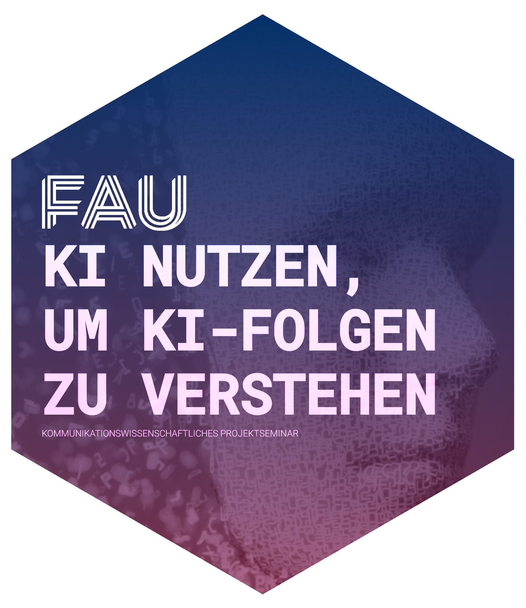

# Projektseminar 24/25

<!-- badges: start -->

<!--   -->

<!-- badges: end -->

  

## Links

🔗 to github-page of the course: <https://faucommsci.github.io/ps_24>

<!-- 🔗 to Binder github-respository of the course: <https://github.com/faucommsci/dbd_binder> -->

🔗 to [Assistant Professorship for Communication Science](https://www.communicationscience.rw.fau.de/) \[english\]

🔗 to [Chair of Communication Science](https://www.kowi.rw.fau.de/) \[german\]

